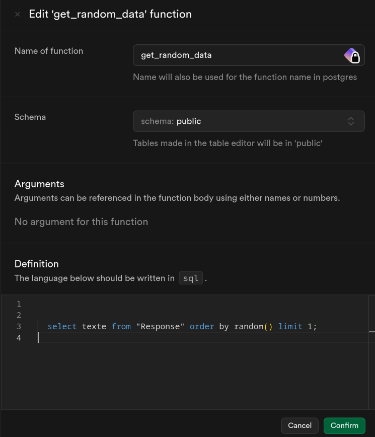

Pour lancer il faut les variable d'environnement suivantes :  

- SUPABASE_URL, l'url du projet supabase  
- TABLE_NAME, le nom de la table dans la database  
- TELEGRAM_TOKEN, le token du bot telegram  
- SUPABASE_SERVICE_ROLE_KEY, la service key de supabase, permet d'avoir accès à toute la database dans la RLS policy et comme ca pas besoin d'un user  

Il faut dans supabase faire une database function pour faire une row aléeatoire :

Il faut que la table dispose de 2 colonnes :

1. la première pour l'id
2. la deuxième nommé "texte" qui stoquera du "texte"
